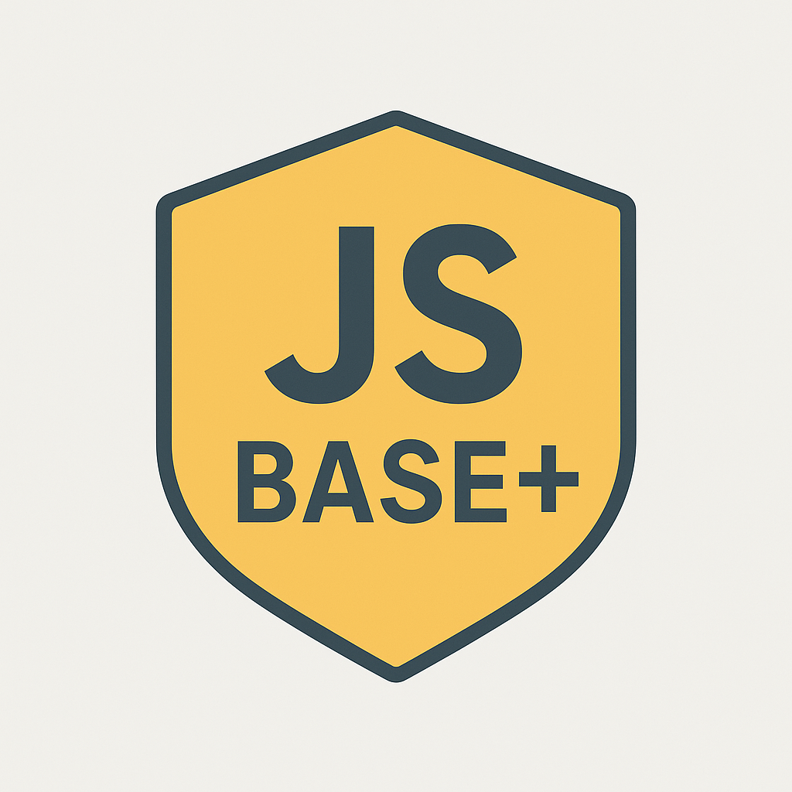

  

<h1 align="center">💼 JSBC+ — The JS-BASE+ Collaboration Tool</h1>

<em>Centralized project planning, contribution, and growth tracking for JS-Base+.</em>

---

## 🚀 Overview

**JSBC+** is a full-featured, web and mobile collaboration tool designed for the JS-Base+ platform.  
It empowers students, new graduates, self-taught developers, and professionals to:
- Collaborate efficiently on real projects,
- Track their contributions and growth, and
- Build meaningful portfolios through clear participation records.

This tool will act as the **beating heart of JS-Base+**, providing transparent, community-driven management of projects from ideation to deployment — and beyond.

---

## 🧠 Why JSBC+?

Many aspiring contributors struggle with:
- No experience
- No professional network
- No clear record of impact

**JSBC+ addresses this** by offering:
- A centralized platform to manage project participation
- Audit logs and personal collaboration summaries
- Real-time dashboards for teams and admins

---

## ✨ Key Features

### 🔐 Admin Dashboard
- Platform-wide participant and project management
- Invite contributors, assign project roles
- View logs, metrics, and team progress
- Export contributor reports

### 💬 ChartRoom (Per Project)
Each project gets its own live space, including:
- **Project Administrators**
- **Init Board**
  - Project name, metadata, category
  - Sent invitations, opt-ins, accepted roles
  - Start or proposal documentation
- **Collaborators** (planning & setup)
- **Contributors** (implementation)

### 🏢 Chapters & Communities
Organize teams and contributors by:
- Region or university
- Technical specialization
- Interest group or project cluster

### 📜 Activity Trace (Audit)
- Logs all major actions
  - PRs merged, issues resolved, documents updated
  - User joins/leaves, role changes
- Logs exportable per project or per user
- Used for professional growth reports

---

## 📈 Impact

JSBC+ supports JS-Base+'s mission of **project-based skill building** and **community reset** by:
- Giving visibility to everyone’s efforts
- Helping contributors track and verify experience
- Supporting project planning with clarity and structure

---

## 🧰 Suggested Tech Stack

| Layer           | Technologies                        |
|----------------|-------------------------------------|
| **Frontend**    | React / Next.js (Web), React Native |
| **Backend**     | Node.js / NestJS                    |
| **Database**    | PostgreSQL + Prisma ORM             |
| **Realtime**    | Socket.IO / Firebase                |
| **Mobile App**  | React Native                        |
| **Auth**        | GitHub OAuth or Auth0               |

---

## 🔧 GitHub API Support (Core Functionalities)

JSBC+ will use the GitHub API to enable seamless integration with the JS-Base+ platform.

| Feature                            | GitHub API Support                         |
|------------------------------------|--------------------------------------------|
| 🧑‍🤝‍🧑 List org/repos contributors | [`GET /repos/{owner}/{repo}/contributors`](https://docs.github.com/en/rest/repos/repos#list-repository-contributors) |
| 📂 PR Tracking                     | [`GET /repos/{owner}/{repo}/pulls`](https://docs.github.com/en/rest/pulls/pulls) |
| 🧵 Issue Tracking                  | [`GET /repos/{owner}/{repo}/issues`](https://docs.github.com/en/rest/issues/issues) |
| 📊 User contribution stats         | [`GET /repos/{owner}/{repo}/stats/contributors`](https://docs.github.com/en/rest/metrics/statistics#get-contributors-commit-activity) |
| 📃 Repo metadata                  | [`GET /repos/{owner}/{repo}`](https://docs.github.com/en/rest/repos/repos#get-a-repository) |
| 👥 User info                       | [`GET /users/{username}`](https://docs.github.com/en/rest/users/users#get-a-user) |
| ✅ Commit logs by author          | [`GET /repos/{owner}/{repo}/commits`](https://docs.github.com/en/rest/commits/commits) |

> ⚠️ For now, JSBC+ will integrate with GitHub using personal or app access tokens on behalf of contributors. Once the platform becomes a GitHub Organization, even more API integrations will be unlocked (e.g., org-level role management).

---

## ✅ Contribution & Flow

This project is currently proposed and pending approval.  
If approved, this repository will be created under JS-Base+ and follow the usual contribution and collaboration workflows.

> 📌 Contribution acceptance is on a first-come, first-serve basis for core roles. Others are welcome to contribute, review, and improve as the project grows.

---

## 📄 Proposal Submission Info (for JSB-AddProject)

- Folder Name: `jsbc-plus`
- Proposal Doc: `README.md` (this file)
- Status: **Proposed**
- Submitted by: _nforne_

---

## 💬 Let’s Build!

**JSBC+** is more than just a dashboard — it’s the **foundation** for long-term, transparent, impactful project collaboration.  
Let’s empower developers to build together, and grow with purpose.

---

<strong>JS-Base+ is about project-based set or reset through community collaboration.</strong>

